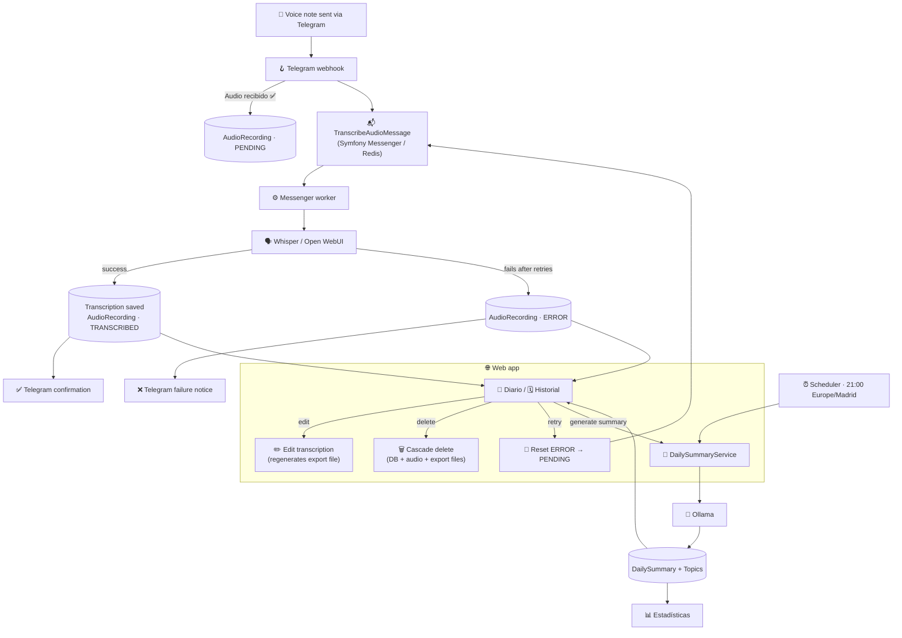

# 🎙️ Telegram Voice Notes

Web application that receives voice notes via Telegram, automatically transcribes them, generates a daily summary with the topics discussed, and lets you review/edit everything from a web interface with login.

> 📄 The full domain specification, flows and data model live in [`Especificaciones.md`](./Especificaciones.md) (Spanish). This README is just a technical summary. A Spanish version of this README is available at [`doc/README_ES.md`](./doc/README_ES.md).

## 🧱 Tech stack

| | Component | Technology |
|---|---|---|
| 🐘 | Language / runtime | PHP >= 8.4 |
| 🎼 | Framework | Symfony (latest LTS) |
| 🌿 | Views | Twig |
| 🗃️ | ORM | Doctrine |
| 📝 | Logging | Monolog |
| 🐬 | Database | PostgreSQL 16 + pgvector |
| 📬 | Queue / async | Symfony Messenger (Doctrine or Redis) |
| ⏰ | Scheduler | Symfony Scheduler |
| 🐳 | Containers | Docker + Docker Compose |
| 🗣️ | Transcription (STT) | Open WebUI (local Whisper) |
| 🧠 | Summary / topics (LLM) | Ollama via OpenAI-compatible API |
| 🔎 | Semantic search | Ollama embeddings (`nomic-embed-text`) + pgvector cosine distance |
| 🤖 | Bot | Telegram Bot API |
| 🖥️ | Target infrastructure | Mini PC with 32GB RAM |

## 🏗️ Architecture

Personal single-user project — deliberately avoiding over-engineering:

- ❌ No EasyAdmin — custom dashboards with Symfony controllers + `FormType`
- ❌ No strict hexagonal architecture or separate Domain/Application/Infrastructure layers — Doctrine entities ARE the domain model
- ❌ No CQRS or general command/query bus
- ✅ Single `User` entity in the database (Symfony Security) — no self-registration or web password recovery; users are managed via `bin/console app:user:*`
- ✅ Targeted interfaces (ports) where there's a real reason: `TranscriberInterface`, `SummaryGeneratorInterface`
- ✅ Symfony Messenger used only for the Telegram → transcription chain

More detail and rationale in [`AGENTS.md`](./AGENTS.md) and section 4 of [`Especificaciones.md`](./Especificaciones.md).

## 🔄 General flow

1. 📲 User sends an audio message to the Telegram bot
2. 🪝 The Symfony webhook receives it and replies quickly ("Audio recibido ✅")
3. 📬 Symfony Messenger dispatches the transcription asynchronously
4. 🗣️➡️📄 Whisper / Open WebUI transcribes the audio; on failure it's retried and, if it keeps failing, marked `ERROR` (retryable from the web)
5. ⏰ At 21:00 (Europe/Madrid), Symfony Scheduler generates the daily summary with Ollama — or on demand, right away, from a button in Diario
6. 🌐 The user reviews the day from the web: **Diario**, **Historial**, **Estadísticas** — editing transcriptions, retrying failed ones, or deleting audios in cascade (DB + files)



## 📂 Views

- 🔐 Login
- 📔 Diario (Journal) — today's audios + transcriptions, with the daily summary at the end
- 🗓️ Historial (History) — browse by date
- 📊 Estadísticas (Stats) — audios/day, average duration, frequent topics
- 🚪 Logout

## 🌳 Version control

Git Flow (`main` for releases only, `develop` as the integration branch). See [`AGENTS.md`](./AGENTS.md) for branch details and commands.

## 🔍 Static analysis

CI (`.github/workflows/ci.yml`) runs on every push/PR: PHP-CS-Fixer and PHPStan, then PHPUnit with coverage, then SonarQube with that coverage. Locally:

```bash
make cs-check   # PSR-12
make phpstan    # PHPStan (level 5 + baseline)
make test       # PHPUnit
```

To run SonarQube locally (Docker only, no scanner install needed; no coverage data):

```bash
SONAR_TOKEN=<your-token> make sonar
```

`SONAR_HOST_URL` defaults to `https://sonarqube.jfarinos.keenetic.pro` and can be overridden the same way.

Pushing a `X.Y.Z` tag creates the GitHub Release automatically from the matching `CHANGELOG.md` section (`.github/workflows/release.yml`).

## 🚀 Deploying

Before deploying (or updating `OLLAMA_EMBEDDING_MODEL`), make sure the embeddings model is pulled on the Ollama server (e.g. `ollama pull nomic-embed-text`) — semantic search generates embeddings on demand and fails silently (logged, non-blocking) if the model isn't available.

## 🚧 Status

In active development, deployed and in daily use. See [`openspec/changes/archive/`](./openspec/changes/archive/) for the history of implemented changes.
