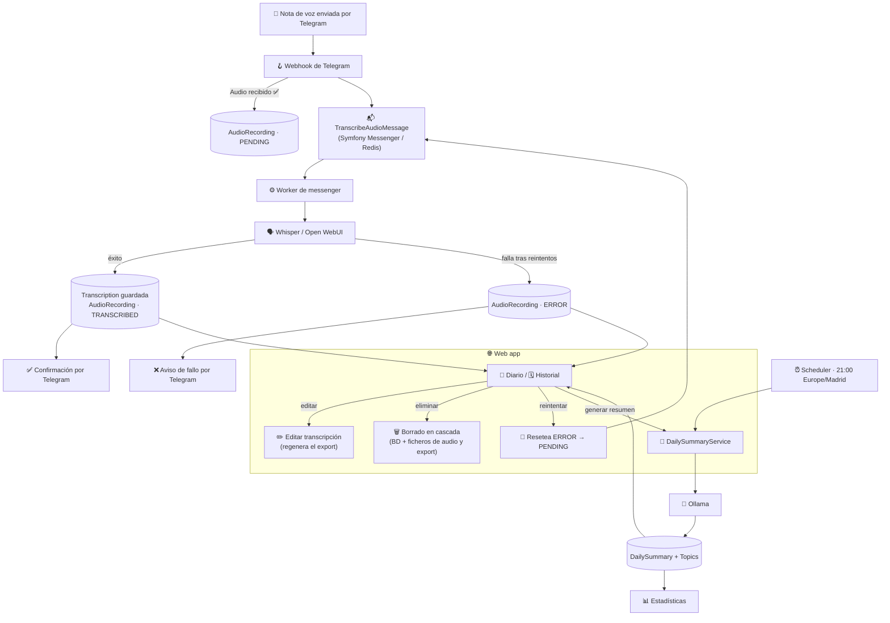

# 🎙️ Telegram Voice Notes

Aplicación web que recibe notas de voz por Telegram, las transcribe automáticamente, genera un resumen diario con los temas tratados y permite consultar/editar todo desde una interfaz web con login.

> 📄 La especificación completa del dominio, flujos y modelo de datos vive en [`Especificaciones.md`](../Especificaciones.md). Este README es solo un resumen técnico. Versión en inglés disponible en [`README.md`](../README.md).

## 🧱 Stack tecnológico

| | Componente | Tecnología |
|---|---|---|
| 🐘 | Lenguaje / runtime | PHP >= 8.4 |
| 🎼 | Framework | Symfony (última LTS) |
| 🌿 | Vistas | Twig |
| 🗃️ | ORM | Doctrine |
| 📝 | Logging | Monolog |
| 🐬 | Base de datos | PostgreSQL 16 |
| 📬 | Cola / async | Symfony Messenger (Doctrine o Redis) |
| ⏰ | Scheduler | Symfony Scheduler |
| 🐳 | Contenedores | Docker + Docker Compose |
| 🗣️ | Transcripción (STT) | Open WebUI (Whisper local) |
| 🧠 | Resumen / temas (LLM) | Ollama vía API compatible OpenAI |
| 🤖 | Bot | Telegram Bot API |
| 🖥️ | Infraestructura destino | Mini PC con 32GB RAM |

## 🏗️ Arquitectura

Proyecto personal de un solo usuario — deliberadamente sin sobre-ingeniería:

- ❌ Sin EasyAdmin — dashboards custom con controladores Symfony + `FormType`
- ❌ Sin hexagonal estricta ni capas Domain/Application/Infrastructure — las entidades Doctrine son el modelo de dominio
- ❌ Sin CQRS ni bus general de comandos/queries
- ✅ Entidad `User` única en BD (Symfony Security) — sin registro ni recuperación de contraseña por web; se gestiona con `bin/console app:user:*`
- ✅ Interfaces puntuales donde hay razón real: `TranscriberInterface`, `SummaryGeneratorInterface`
- ✅ Symfony Messenger solo para la cadena Telegram → transcripción

Más detalle y motivos en [`CLAUDE.md`](../CLAUDE.md) y la sección 4 de [`Especificaciones.md`](../Especificaciones.md).

## 🔄 Flujo general

1. 📲 Usuario envía un audio al bot de Telegram
2. 🪝 Webhook de Symfony lo recibe y responde rápido ("Audio recibido ✅")
3. 📬 Symfony Messenger despacha la transcripción de forma asíncrona
4. 🗣️➡️📄 Whisper / Open WebUI transcribe el audio; si falla se reintenta y, si sigue fallando, queda en `ERROR` (reintentable desde la web)
5. ⏰ A las 21:00 (Europe/Madrid), Symfony Scheduler genera el resumen diario con Ollama — o al momento, bajo demanda, con un botón en Diario
6. 🌐 El usuario revisa el día desde la web: **Diario**, **Historial**, **Estadísticas** — editando transcripciones, reintentando las que fallaron, o eliminando audios en cascada (BD + ficheros)

## 📂 Vistas

- 🔐 Login
- 📔 Diario — audios + transcripciones del día, con resumen al final
- 🗓️ Historial — navegación por fecha
- 📊 Estadísticas — nº de audios/día, duración media, temas frecuentes
- 🚪 Logout

## 🌳 Control de versiones

Git Flow (`main` solo releases, `develop` como rama de integración). Ver [`CLAUDE.md`](../CLAUDE.md) para el detalle de ramas y comandos.

## 🚧 Estado

En desarrollo activo, desplegado y en uso diario. El historial de cambios implementados está en [`openspec/changes/archive/`](../openspec/changes/archive/).
