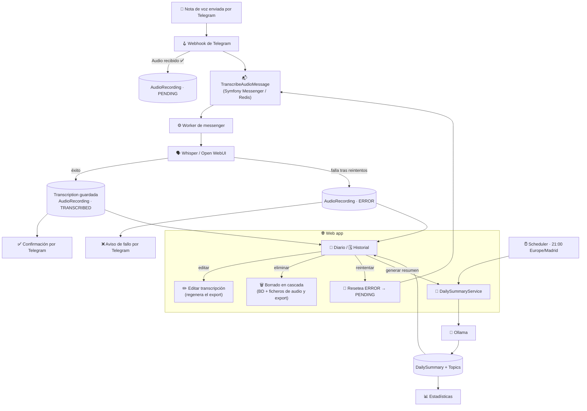

# 🎙️ Telegram Voice Notes

Aplicación web que recibe notas de voz por Telegram, las transcribe automáticamente, genera un resumen diario con los temas tratados y permite consultar/editar todo desde una interfaz web con login.

> 📄 La especificación completa del dominio, flujos y modelo de datos vive en [`Especificaciones.md`](../Especificaciones.md). Este README es solo un resumen técnico. Versión en inglés disponible en [`README.md`](../README.md).

## 🧱 Stack tecnológico

| | Componente | Tecnología |
|---|---|---|
| 🐘 | Lenguaje / runtime | PHP >= 8.4 |
| 🎼 | Framework | Symfony (última LTS) |
| 🌿 | Vistas | Twig |
| 🗃️ | ORM | Doctrine |
| 📝 | Logging | Monolog |
| 🐬 | Base de datos | PostgreSQL 16 + pgvector |
| 📬 | Cola / async | Symfony Messenger (Doctrine o Redis) |
| ⏰ | Scheduler | Symfony Scheduler |
| 🐳 | Contenedores | Docker + Docker Compose |
| 🗣️ | Transcripción (STT) | Open WebUI (Whisper local) |
| 🧠 | Resumen / temas (LLM) | Ollama vía API compatible OpenAI |
| 🔎 | Búsqueda semántica | Embeddings de Ollama (`nomic-embed-text`) + distancia coseno con pgvector |
| 🤖 | Bot | Telegram Bot API |
| 🖥️ | Infraestructura destino | Mini PC con 32GB RAM |

## 🏗️ Arquitectura

Proyecto personal de un solo usuario — deliberadamente sin sobre-ingeniería:

- ❌ Sin EasyAdmin — dashboards custom con controladores Symfony + `FormType`
- ❌ Sin hexagonal estricta ni capas Domain/Application/Infrastructure — las entidades Doctrine son el modelo de dominio
- ❌ Sin CQRS ni bus general de comandos/queries
- ✅ Entidad `User` única en BD (Symfony Security) — sin registro ni recuperación de contraseña por web; se gestiona con `bin/console app:user:*`
- ✅ Interfaces puntuales donde hay razón real: `TranscriberInterface`, `SummaryGeneratorInterface`, `AudioProbeInterface`
- ✅ Symfony Messenger solo para la cadena Telegram → transcripción

Más detalle y motivos en [`AGENTS.md`](../AGENTS.md) y la sección 4 de [`Especificaciones.md`](../Especificaciones.md).

## 🔄 Flujo general

1. 📲 Usuario envía un audio al bot de Telegram
2. 🪝 Webhook de Symfony lo recibe y responde rápido ("Audio recibido ✅")
3. 📬 Symfony Messenger despacha la transcripción de forma asíncrona
4. 🗣️➡️📄 Whisper / Open WebUI transcribe el audio; si falla se reintenta y, si sigue fallando, queda en `ERROR` (reintentable desde la web)
5. ⏰ A las 21:00 (Europe/Madrid), Symfony Scheduler genera el resumen diario con Ollama — o al momento, bajo demanda, con un botón en Diario. Si el resumen no sale en castellano se rechaza y se reintenta; si sigue fallando, se avisa por Telegram
6. 🔔 A las 08:00 (Europe/Madrid), Telegram avisa de los recordatorios del día
7. 🌐 El usuario lo revisa todo desde la web: **Diario**, **Historial**, **Resúmenes**, **Búsqueda**, **Recordatorios**, **Estadísticas**, **Temas** — editando transcripciones, reintentando las que fallaron, o eliminando audios en cascada (BD + ficheros)


```mermaid
flowchart TD
    A["📲 Nota de voz enviada por Telegram"] --> B["🪝 Webhook de Telegram"]
    B -->|"Audio recibido ✅"| C[("AudioRecording · PENDING")]
    B --> D["📬 TranscribeAudioMessage<br/>(Symfony Messenger / Redis)"]
    D --> E["⚙️ Worker de messenger"]
    E --> F["🗣️ Whisper / Open WebUI"]
    F -->|éxito| G[("Transcription guardada<br/>AudioRecording · TRANSCRIBED")]
    F -->|"falla tras reintentos"| H[("AudioRecording · ERROR")]
    G --> I["✅ Confirmación por Telegram"]
    H --> J["❌ Aviso de fallo por Telegram"]

    subgraph WEB["🌐 Web app"]
        K["📔 Diario / 🗓️ Historial"]
        K -->|editar| L["✏️ Editar transcripción<br/>(regenera el export)"]
        K -->|eliminar| M["🗑️ Borrado en cascada<br/>(BD + ficheros de audio y export)"]
        K -->|reintentar| N["🔄 Resetea ERROR → PENDING"]
        K -->|"generar resumen"| O["🧠 DailySummaryService"]
    end

    G --> K
    H --> K
    N --> D

    P["⏰ Scheduler · 21:00 Europe/Madrid"] --> O
    O --> Q["🧠 Ollama"]
    Q --> R[("DailySummary + Topics")]
    R --> K
    R --> S["📊 Estadísticas"]
```

## 📂 Vistas

- 🔐 Login
- 📔 Diario — audios + transcripciones del día, con resumen al final
- 🗓️ Historial — navegación por fecha
- 🏷️ Resúmenes — listado de resúmenes diarios con sus temas, filtrable por rango de fechas
- 🔎 Búsqueda — búsqueda en lenguaje natural sobre transcripciones y resúmenes diarios (embeddings), más búsqueda por palabras en recordatorios (sin distinguir mayúsculas ni tildes) en una sección propia
- 🔔 Recordatorios — calendario mensual, listados de próximos y pasados, alta/edición/borrado
- 📊 Estadísticas — nº de audios/día, duración media, temas frecuentes, consumo de IA
- 🏷️ Temas — tabla para renombrar y fusionar temas duplicados
- 🚪 Logout

## 📱 API JSON

Segunda entrada bajo `/api/v1`, pensada para la app de iPhone (plan por fases en [ROADMAP.md](../ROADMAP.md)). La web sigue funcionando con su login de sesión.

- 🔑 Tokens opacos por dispositivo: `POST /api/v1/login` devuelve el token, que después se envía como `Authorization: Bearer <token>`. Solo se guarda su hash SHA-256 y caduca tras 90 días sin uso
- 🚪 `POST /api/v1/logout` revoca el token en uso; `GET /api/v1/me` devuelve el usuario y los datos del token
- 🧱 Todos los errores son `{"code": "...", "message": "..."}`; el login admite 5 intentos cada 15 minutos
- 🛠️ Los tokens se listan y revocan por consola: `bin/console app:user:token:list <username>` / `app:user:token:revoke <id>`
- 📖 Documentación: Swagger UI en `/doc/api` (con sesión web), esquema en [openapi.json](openapi.json) y colecciones de peticiones en [MyDiary.postman_collection.json](MyDiary.postman_collection.json) y [api.http](api.http)

## 🌳 Control de versiones

Git Flow (`main` solo releases, `develop` como rama de integración). Ver [`AGENTS.md`](../AGENTS.md) para el detalle de ramas y comandos.

## 🔍 Análisis estático

La CI (`.github/workflows/ci.yml`) se ejecuta en cada push/PR: PHP-CS-Fixer y PHPStan, después PHPUnit con cobertura y por último SonarQube con esa cobertura (solo en `develop` y en PRs: SonarQube Community no distingue ramas y `main` solo recibe código ya analizado en `develop`). En local:

```bash
make cs-check   # PSR-12
make phpstan    # PHPStan (nivel 5 + baseline)
make test       # PHPUnit
```

Para ejecutar SonarQube en local (solo Docker, sin instalar el scanner; sin datos de cobertura):

```bash
SONAR_TOKEN=<tu-token> make sonar
```

`SONAR_HOST_URL` vale por defecto `https://sonarqube.jfarinos.keenetic.pro` y se puede sobrescribir igual.

Al hacer push de una tag `X.Y.Z` se crea automáticamente la GitHub Release con la sección correspondiente del `CHANGELOG.md` (`.github/workflows/release.yml`).

## 🚀 Despliegue

`make deploy` hace pull de `main`, limpia la caché y reinicia `diary-php` y `diary-messenger-worker`, pero **no ejecuta migraciones**: si las notas de la release en [`CHANGELOG.md`](../CHANGELOG.md) incluyen alguna, ejecutar `make migrate` después.

Antes de desplegar (o de cambiar `OLLAMA_EMBEDDING_MODEL`), comprobar que el modelo de embeddings está descargado en el servidor de Ollama (p. ej. `ollama pull nomic-embed-text`): la búsqueda semántica genera embeddings bajo demanda y, si el modelo no está disponible, falla en silencio (se loguea, sin bloquear).

## 🚧 Estado

En desarrollo activo, desplegado y en uso diario. El historial de cambios implementados está en [`openspec/changes/archive/`](../openspec/changes/archive/).
